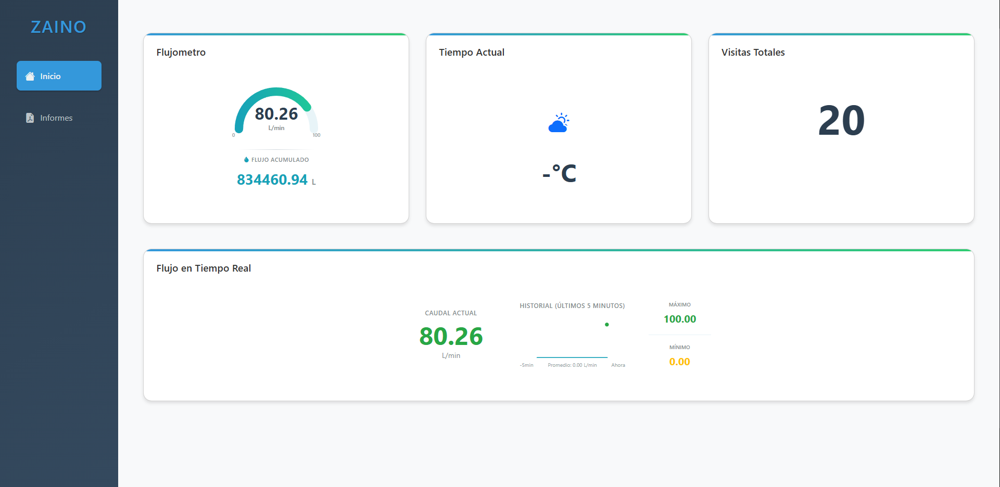
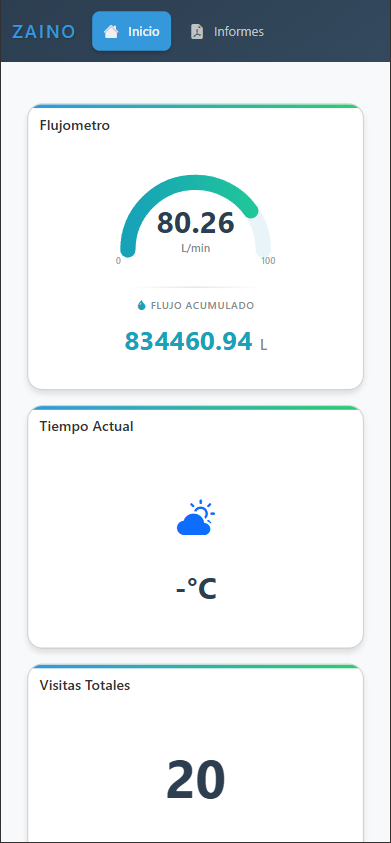
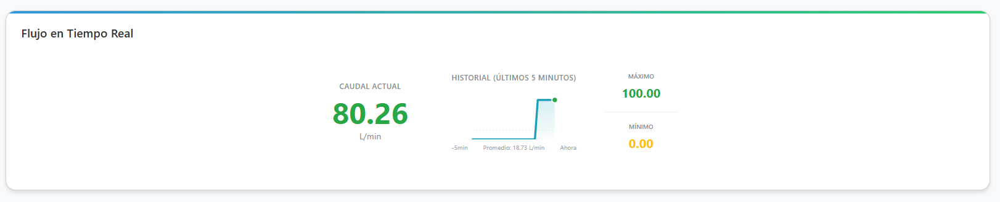
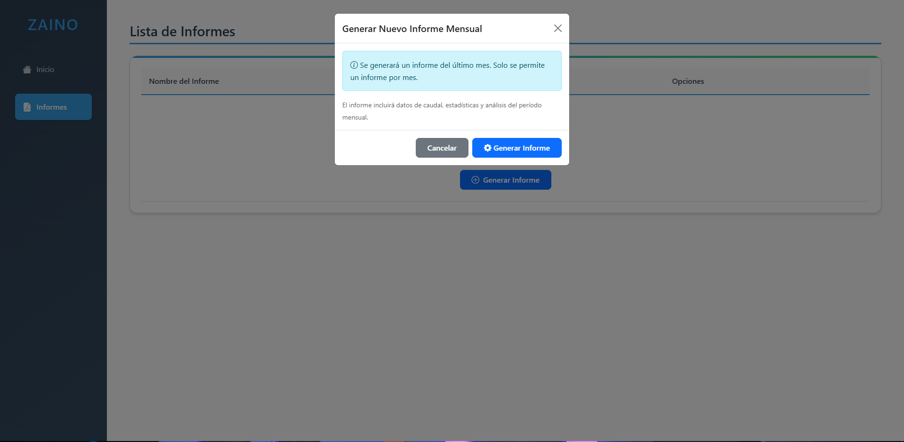
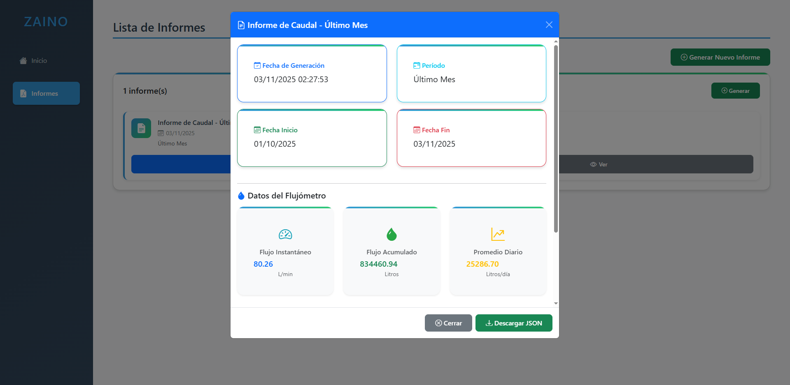
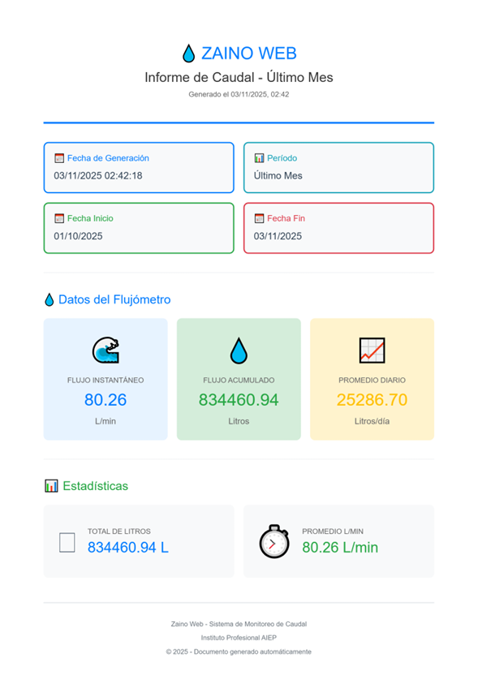

# 💧 Zaino Web - Flujómetro de Agua en Tiempo Real


## 📋 Descripción

**Zaino Web** es una aplicación web desarrollada en colaboración con el **Instituto Profesional AIEP** para una comunidad que necesitaba monitorear en tiempo real el caudal de agua de un río. La solución integra hardware IoT con Arduino, sensores de flujo, y una interfaz web moderna desarrollada con Python Flask, permitiendo visualizar datos en tiempo real, estadísticas históricas y generar informes.

Este proyecto combina tecnologías de IoT, backend con Flask, y un frontend responsive para ofrecer una experiencia completa de monitoreo hídrico.

---

## 🎉 Novedades v1.1.0

### 📄 Sistema de Informes Completo
- ✅ **Generación mensual automática** con validación de duplicados
- ✅ **Exportación a PDF profesional** del lado del cliente (sin carga en servidor)
- ✅ **Tres formatos de exportación**: Ver en navegador, descargar JSON, exportar PDF
- ✅ **Diseño optimizado** para impresión en formato A4
- ✅ **Validación inteligente**: Un informe por mes con cálculo automático de días del período
- ✅ **Feedback visual completo**: Toasts, spinners, modales con estado de carga
- ✅ **Botones de acción directa**: Exportar sin abrir el modal

### 🔧 Mejoras Técnicas
- ✅ **Bootstrap JS completo**: Modales y componentes interactivos funcionales
- ✅ **html2canvas + jsPDF**: Generación de PDFs de alta calidad en el cliente
- ✅ **Sistema de notificaciones**: Toasts con auto-cleanup
- ✅ **Modales reutilizables**: Sin duplicación en el DOM
- ✅ **Validaciones robustas**: Manejo completo de errores con restauración de UI

---

## ✨ Características Principales

### 🌊 Monitoreo en Tiempo Real
- **Flujo instantáneo** (L/min) con medidor visual tipo gauge
- **Flujo acumulado** total de litros
- **Gráfico histórico** de los últimos 5 minutos
- **Actualización automática** cada 10 segundos
- **Estadísticas en vivo**: máximo, mínimo y promedio

### 🌤️ Datos Meteorológicos
- Integración con **Weathercloud API**
- Temperatura y sensación térmica
- Presión atmosférica
- Indicadores visuales del clima

### 📊 Panel de Control
- **Dashboard intuitivo** con métricas clave
- **Vista responsive** para móviles, tablets y desktop
- **Sistema de caché** para optimizar peticiones
- **Sistema de informes completo**:
  - Generación de informes mensuales automáticos
  - Validación de duplicados (un informe por mes)
  - Descarga en formato JSON
  - **Exportación a PDF** con diseño profesional
  - Visualización detallada con estadísticas e iconos
  - Almacenamiento automático en sistema de archivos
  - Gestión completa (crear, ver, descargar PDF/JSON, eliminar)
  - Botones de acción directa desde la lista
  - Feedback visual con toasts y spinners

### 🎨 Interfaz Moderna
- Diseño **Material Design** con gradientes
- **Animaciones suaves** y transiciones
- **Modo oscuro** en menú lateral
- **Iconos Bootstrap** para mejor UX
- **Modales interactivos** con validaciones
- **Sistema de notificaciones** (Toasts) con feedback visual

### 📄 Exportación de Informes
- **Exportación a PDF profesional** del lado del cliente
- Diseño optimizado para impresión (formato A4)
- Conversión HTML→Canvas→PDF con alta calidad
- Paginación automática para contenido extenso
- Header personalizado con logo y fecha de generación
- Footer con información institucional
- Tres formas de exportar:
  - Desde modal de visualización
  - Directamente desde la lista (desktop)
  - Desde cards móviles
- Sin necesidad de procesamiento en el servidor

---

## 🛠️ Tecnologías Utilizadas

### Backend
- **Python 3.8+**
- **Flask 2.0+** - Framework web
- **Requests** - Cliente HTTP
- **OAuth2Session** - Autenticación con Arduino IoT Cloud
- **Python-dotenv** - Gestión de variables de entorno

### Frontend
- **HTML5 / CSS3**
- **JavaScript (ES6+)**
- **jQuery 3.6**
- **Bootstrap 5.3** - Framework CSS completo con JavaScript
- **Bootstrap Icons** - Iconografía vectorial
- **SVG** - Gráficos vectoriales para visualizaciones
- **html2canvas 1.4.1** - Conversión de HTML a imagen para PDFs
- **jsPDF 2.5.1** - Generación de archivos PDF del lado del cliente

### APIs Integradas
- **Arduino IoT Cloud API** - Obtención de datos del flujómetro (API oficial)
- **Weathercloud API** - Datos meteorológicos en tiempo real (⚠️ Ingeniería inversa - no oficial)

> **Nota técnica**: La integración con Weathercloud fue implementada mediante ingeniería inversa, ya que no existe una API pública oficial. Ver sección de Características Técnicas para más detalles.

### IoT Hardware
- **Arduino** con conectividad IoT
- **Sensores de flujo** para medición de caudal
- **Comunicación en tiempo real** con Arduino IoT Cloud

---

## 📁 Estructura del Proyecto

```
zaino-web/
│
├── app/
│   ├── __init__.py
│   ├── controllers/
│   │   ├── api_controller.py      # Endpoints de la API
│   │   └── app_controller.py      # Controladores de vistas
│   ├── static/
│   │   ├── css/
│   │   │   └── app.css            # Estilos principales
│   │   ├── js/
│   │   │   ├── app.js             # Lógica principal
│   │   │   └── debug.js           # Herramientas de debug
│   │   └── img/                   # Imágenes y recursos
│   ├── templates/
│   │   └── app.html               # Template principal
│   └── utils/
│       ├── config.py              # Configuración
│       └── weathercloud_py.py     # Cliente Weathercloud
│
├── informes/                      # Informes generados (creado automáticamente)
├── .env                           # Variables de entorno (no incluido)
├── .gitignore
├── app.py                         # Punto de entrada
├── Pipfile                        # Dependencias Pipenv
├── requirements.txt               # Dependencias pip
├── visitas.json                   # Contador de visitas
└── README.md
```

---

## ⚙️ Configuración

### 1. Variables de Entorno (`.env`)

Crea un archivo `.env` en la raíz del proyecto con las siguientes variables:

```env
# Arduino IoT Cloud Credentials
CLIENT_ID=tu_client_id_de_arduino
CLIENT_SECRET=tu_client_secret_de_arduino

# Weathercloud API Credentials
WEATHERCLOUD_EMAIL=tu_email@example.com
WEATHERCLOUD_PASSWORD=tu_password_weathercloud

# Configuración de estación meteorológica
WEATHERCLOUD_DEVICEID=ID_DE_TU_ESTACION

# Flask Security - Clave secreta (IMPORTANTE EN PRODUCCIÓN)
# Genera una con: python -c "import os; print(os.urandom(24).hex())"
SECRET_KEY=tu_clave_secreta_aleatoria_aqui
```

> **Nota de Seguridad**: Si no especificas una `SECRET_KEY`, la aplicación generará una aleatoria automáticamente. Sin embargo, esto hará que las sesiones se invaliden cada vez que reinicies el servidor. Para producción, **siempre configura una SECRET_KEY fija**.

### 2. Obtener Credenciales

#### Arduino IoT Cloud
1. Crea una cuenta en [Arduino IoT Cloud](https://cloud.arduino.cc/)
2. Ve a **API Keys** en tu panel
3. Crea un nuevo **Client ID** y **Client Secret**
4. Configura un **Thing** llamado "Medidor de Flujo" con propiedades:
   - `constflow` (float): Flujo instantáneo en L/min
   - `instflow` (float): Flujo acumulado en Litros

#### Weathercloud
1. Regístrate en [Weathercloud](https://weathercloud.net/)
2. Obtén el ID de tu estación meteorológica
3. Usa tus credenciales de login

> **⚠️ Nota Importante sobre Weathercloud API**  
> Weathercloud no proporciona una API pública oficial documentada. Este proyecto utiliza **ingeniería inversa** de las peticiones HTTP realizadas por su sitio web para acceder a los datos meteorológicos. La implementación se encuentra en `app/utils/weathercloud_py.py` y simula el comportamiento de autenticación del navegador.
> 
> **Implicaciones:**
> - ✅ Funcional y probado
> - ⚠️ Puede cambiar sin previo aviso si Weathercloud modifica su sitio
> - 📝 Uso bajo tu propia responsabilidad
> - 🔐 Mantén tus credenciales seguras en el `.env`
> 
> Si Weathercloud lanza una API oficial en el futuro, se recomienda migrar a ella.

---

## 🚀 Instalación

### Prerequisitos
- Python 3.8 o superior
- pip o pipenv
- Git

### Opción 1: Usando Pipenv (Recomendado)

```bash
# Clonar el repositorio
git clone https://github.com/tu-usuario/zaino-web.git
cd zaino-web

# Instalar pipenv si no lo tienes
pip install pipenv

# Instalar dependencias
pipenv install

# Activar el entorno virtual
pipenv shell

# Crear archivo .env y configurar variables
cp .env.example .env
# Edita el archivo .env con tus credenciales

# Ejecutar la aplicación
python app.py
```

### Opción 2: Usando pip

```bash
# Clonar el repositorio
git clone https://github.com/tu-usuario/zaino-web.git
cd zaino-web

# Crear entorno virtual
python -m venv venv

# Activar entorno virtual
# En Windows:
venv\Scripts\activate
# En Linux/Mac:
source venv/bin/activate

# Instalar dependencias
pip install -r requirements.txt

# Crear archivo .env y configurar variables
cp .env.example .env
# Edita el archivo .env con tus credenciales

# Ejecutar la aplicación
python app.py
```

La aplicación estará disponible en: `http://localhost:5000`

---

## 🌐 Despliegue

### URL Oficial
🔗 **Producción**: [https://aguaconecta.cl](https://aguaconecta.cl)  
🔗 **Demo**: [https://aguaconecta.urrahost.app](https://aguaconecta.urrahost.app)

### Despliegue en Producción

#### Usando Docker 🐳

**1. Crear archivo `Dockerfile`**
```dockerfile
# Use official Python base image
FROM python:3.11-slim

# Set working directory
WORKDIR /app

# Install curl
RUN apt-get update && apt-get install -y curl && rm -rf /var/lib/apt/lists/*

# Copy dependency files
COPY requirements.txt ./

# Install dependencies
RUN pip install --no-cache-dir -r requirements.txt

# Copy the rest of the application
COPY . .

# Expose port
EXPOSE 5000

# Command to run the app
CMD ["python", "app.py"]
```
#### Flask nativo (Solo desarrollo/pruebas)

> **⚠️ ADVERTENCIA**: Flask nativo NO es recomendado para producción. Usa Docker en su lugar.

**Ejecución directa**
```bash
# Configurar modo producción
export FLASK_ENV=production  # Linux/Mac
$env:FLASK_ENV="production"  # Windows PowerShell

# Ejecutar
python app.py
```

---

## 📊 API Endpoints

### Flujómetro
- `GET /api/arduino/flowmeter` - Obtiene datos del flujómetro con caché de 8s
- `GET /api/test-api` - Prueba conexión con Arduino IoT Cloud

### Informes
- `GET /api/informes` - Lista todos los informes disponibles con metadata
- `POST /api/informes/generar` - Genera un nuevo informe mensual
  ```json
  {
    "periodo": "ultimo_mes"  // Solo mensual permitido
  }
  ```
  **Validaciones**:
  - Solo un informe por mes
  - Calcula días transcurridos vs días del mes (28-31)
  - Retorna error si ya existe informe del mes actual
  
- `GET /api/informes/<informe_id>` - Obtiene un informe específico con todos sus datos
- `DELETE /api/informes/<informe_id>` - Elimina un informe del sistema

### Clima
- `GET /api/weather` - Datos de estación por defecto
- `GET /api/weather/<station_id>` - Datos de estación específica
- `GET /api/weather/nearest?lat={lat}&lon={lon}&radius={radius}` - Estaciones cercanas
- `GET /api/weather/profile/<station_id>` - Perfil de estación
- `GET /api/weather/statistics/<station_id>` - Estadísticas de estación

### Utilidades
- `POST /api/visitas` - Incrementa contador de visitas

---

## 🎯 Características Técnicas

### Sistema de Caché
- **TTL**: 8 segundos para datos del flujómetro
- **Reducción**: ~95% menos peticiones a Arduino IoT Cloud
- **Fallback automático** en caso de rate limiting (429)

### Sistema de Informes
- **Validación inteligente**: Un informe por mes con cálculo de días restantes
- **Almacenamiento**: Sistema de archivos (JSON) con metadata completa
- **Exportación múltiple**: JSON para datos raw, PDF para presentación
- **Generación cliente**: PDFs generados en el navegador sin carga en servidor
- **Calidad profesional**: Diseño A4 optimizado para impresión

### Exportación a PDF
- **Librería html2canvas**: Convierte HTML renderizado a imagen de alta calidad (scale 2x)
- **Librería jsPDF**: Genera PDFs del lado del cliente con paginación automática
- **Sin backend**: Procesamiento 100% en el navegador del usuario
- **Diseño consistente**: Mantiene el estilo visual de la interfaz web
- **Optimizado para impresión**: Formato A4 (210x297mm) con márgenes apropiados

### Responsive Design
- **Mobile-first** approach
- **Breakpoints**: 480px, 768px, 1024px
- **Adaptación automática** de layout en tablets y móviles
- **Touch-friendly** para dispositivos táctiles
- **Cards adaptativas**: Vista de tabla en desktop, cards en móvil

### Optimizaciones
- **Lazy loading** de datos
- **Debouncing** en resize events (250ms)
- **Peticiones controladas** para evitar rate limiting
- **Animaciones con CSS** para mejor rendimiento
- **Toasts con auto-cleanup**: Notificaciones que se eliminan automáticamente
- **Modales reutilizables**: No se duplican en el DOM

### Integración con APIs Privadas (Ingeniería Inversa)

Este proyecto incluye un cliente personalizado para **Weathercloud** (`weathercloud_py.py`) que fue desarrollado mediante ingeniería inversa de las peticiones HTTP del sitio web oficial.

**Proceso de Ingeniería Inversa:**
1. **Análisis de tráfico**: Interceptación de peticiones con DevTools del navegador
2. **Simulación de autenticación**: Replicación del flujo de login con cookies y headers
3. **Endpoints descubiertos**:
   - `/api/weather` - Datos actuales de una estación
   - `/api/weather/nearest` - Estaciones cercanas por coordenadas
   - `/api/weather/profile` - Perfil de estación
   - `/api/weather/statistics` - Estadísticas históricas

**Implementación técnica:**
```python
# Simula el comportamiento del navegador
session = requests.Session()
headers = {
    'User-Agent': 'Mozilla/5.0...',
    'Accept': 'application/json',
    'Referer': 'https://weathercloud.net/'
}
# Autenticación y obtención de tokens de sesión
```

**Mantenimiento:**
- El código puede necesitar actualizaciones si Weathercloud cambia su estructura
- Se recomienda revisar periódicamente el funcionamiento
- Considerar alternativas con APIs oficiales cuando estén disponibles

### Arquitectura del Sistema de Informes

#### Flujo de Generación
1. **Validación**: Sistema verifica que no exista informe del mes actual
2. **Cálculo de período**: Del primer día del mes anterior hasta hoy
3. **Obtención de datos**: Lee desde caché del flujómetro (8s TTL)
4. **Cálculo de estadísticas**: 
   - Flujo instantáneo (L/min)
   - Flujo acumulado (Litros)
   - Promedio diario (basado en días reales del período)
5. **Almacenamiento**: Guarda JSON con timestamp único
6. **Feedback**: Notifica al usuario y recarga la lista

#### Exportación PDF
```
HTML (Modal) → html2canvas → Canvas (PNG) → jsPDF → PDF (A4)
```

**Proceso:**
1. Crea contenedor temporal con diseño optimizado (210mm x 297mm)
2. Aplica estilos inline para consistencia
3. Convierte a canvas de alta resolución (scale 2x)
4. Genera PDF con paginación automática
5. Limpia recursos y descarga archivo

**Ventajas:**
- ✅ Sin carga en servidor
- ✅ Funciona offline (una vez cargada la página)
- ✅ Inmediato (no espera cola de procesamiento)
- ✅ Personalizable (estilos ajustables en código)

---

## 🤝 Contribuir

Las contribuciones son bienvenidas. Para contribuir:

1. Fork el proyecto
2. Crea una rama para tu feature (`git checkout -b feature/AmazingFeature`)
3. Commit tus cambios (`git commit -m 'Add some AmazingFeature'`)
4. Push a la rama (`git push origin feature/AmazingFeature`)
5. Abre un Pull Request

---

## 📝 Licencia

Este proyecto está bajo la Licencia MIT - ver el archivo [LICENSE](LICENSE) para más detalles.

---

## 👥 Autores

- **Desarrollo**: En colaboración con Instituto Profesional AIEP 
- **Comunidad**: Proyecto desarrollado para monitoreo comunitario de recursos hídricos

---

## 📧 Contacto

Para preguntas, sugerencias o reportar problemas:

- **Issues**: [GitHub Issues](https://github.com/IdkBemja/zaino-web/issues)
- **Email**: contact@urrahost.app (Asunto: "Sugerencia/Pregunta/Problemas Zaino Web")

---

## 🙏 Agradecimientos

- Instituto Profesional AIEP por el apoyo en el desarrollo
- Arduino IoT Cloud por proporcionar la infraestructura IoT
- Weathercloud por los datos meteorológicos
- [Maxime-mrl](https://github.com/maxime-mrl/weathercloud-js/tree/main) Por hacer ingenieria inversa a la api privada de Weathercloud para JS (Se adapto para python gracias a este).
- La comunidad que inspiró este proyecto

---

## 📸 Capturas de Pantalla

### Dashboard Principal

*Panel principal con medidor de flujo en tiempo real, datos meteorológicos y contador de visitas*

### Vista Móvil

*Diseño responsive adaptado para dispositivos móviles con cards y botones touch-friendly*

### Monitoreo en Tiempo Real

*Gráfico de flujo en tiempo real con historial de 5 minutos y estadísticas*

### Sistema de Informes

*Lista de informes mensuales con opciones de exportación PDF, descarga JSON y visualización*

### Visualización de Informe

*Modal con estadísticas detalladas, gráficos y datos del flujómetro*

### Exportación a PDF

*Documento PDF generado con diseño profesional listo para imprimir*

---

**Zaino Web** - Monitoreo inteligente de recursos hídricos 💧